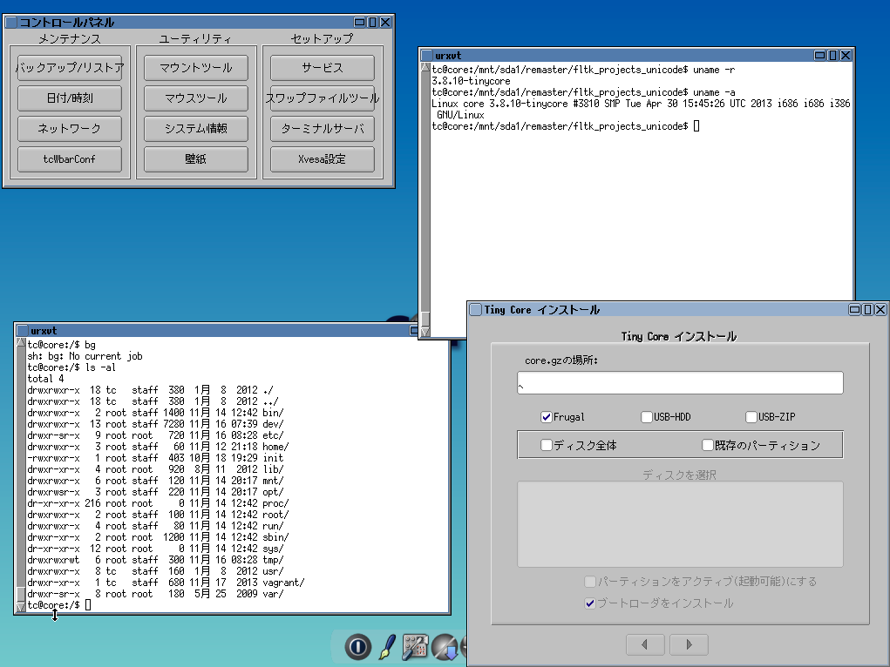

tinycorelinux.jp
================

Building remastered Tiny Core Linux for Japanese users.

Progress Report~ (11/17/2013)
-----------

**Done with major surgery! Now some more test, then repackaging and documenting!**

### DONE

* core.gz (UTF8-ized)
* kmaps (106)
* locale
* fltk-1.3
* timezone
* urxvt
* mplusfont
* XProgs

### NEED MORE TESTING

* scim (installed)
* scim-anthy (installed)
* seamonkey (installed)
* anthy (installed)

  Turns out, TC5 has a good hand in supporting UTF-8.
Developer didn't turn the feature on as the size matters for them.
The part around displaying fonts had to be patched.